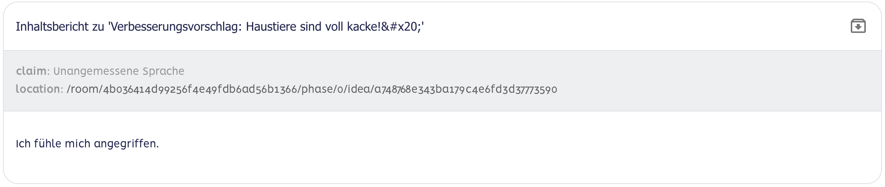

# Administrationsbereich
---
1. [📩 Nachrichten-Menü](#nachrichten-menü)
2. [📢 Ankündigungs-Menü](#ankündigungs-menü)
3. [🚩 Berichte-Menü](#berichte-menü)
4. [🙋 Anfragen-Menü](#anfragen-menü)
---

---

# Nachrichten-Menü

Die Nachrichtenfunktion erlaubt es Administrator\*innen, Nachrichten an bestimmte Nutzer\*innen, Gruppen, Räume oder an alle Nutzer\*innen gleichzeitig zu versenden. Die Nachrichten sind **einseitig** – man kann **nicht darauf antworten**, und **Nutzer\*innen können sich nicht gegenseitig schreiben**.

**Aktionen**

### Nachricht erstellen/versenden
**Wer:** Admin

1. Klicke auf das Nachrichtensymbol im Menü.
2. Klicke auf den „+“-Button.
3. Wähle die Empfängergruppe aus (Einzelperson, Gruppe).
4. Gib den Nachrichtentext ein.
5. Optional: Setze einen Status für die Nachricht.
6. Bestätige die Eingaben zum Versenden.

### Nachricht löschen

1. Aktiviere die Checkbox der Nachricht, die du löschen möchtest.
2. Klicke auf das rote Papierkorb-Symbol.
3. Bestätige das Pop-up-Fenster.

---

# Ankündigungen-Menü

Über das Ankündigungssystem können Administrator*innen Informationen und Zustimmungsabfragen an alle Nutzer*innen senden.

- **Obligatorische Zustimmung:** Blockiert die Nutzung der Anwendung, bis diese bestätigt wurde.
- **Optionale Zustimmung:** Öffnet ein Pop-up, blockiert aber keine Aktionen.
- **Keine Zustimmung erforderlich:** Erscheint nur in den Benachrichtigungen.

**Aktionen**

### Nach Begriff filtern
**Wer:** Admin

1. Klicke auf das Filter-Symbol oben rechts.
2. Wähle einen Filter (Titel, Text, Zustimmung, Ersteller).
3. Gib den Suchbegriff ein.
4. Zum Zurücksetzen: Klicke auf das „X“ im Eingabefeld.

### ➕ Neue Ankündigung erstellen
**Wer:** Admin

1. Klicke auf „+ NEUE ANKÜNDIGUNG“.
2. Gib folgende Daten ein:
   - Titel *(Pflichtfeld)*
   - Text *(Pflichtfeld)*
   - Zustimmungstyp *(Pflichtfeld)*: Keine / Optional / Obligatorisch
   - Zustimmungstext *(Pflichtfeld)*: Konkreter Zustimmungstext zur Bestätigung
   - Status *(optional)*
3. Bestätige die Eingaben.

### 🗑️ Ankündigung löschen
**Wer:** Admin

1. Aktiviere die Checkbox der Ankündigung, die gelöscht werden soll.
2. Klicke auf Ankündigung entfernen.
3. Bestätige das Popup-Fenster.

---

# Berichte-Menü

In diesem Bereich werden **alle gemeldeten Inhalte** gesammelt.

## Ansicht

Die Berichte bestehen aus vier Elementen:
1. Einer Überschrift die angibt, welche Einheit (bspw. Box, Kommentar oder Idee) gemeldet wurde, sowie dem zugehörigen Titel dieser Einheit.
2. Dem Grund ("claim") hier für gibt es elf Kategorien:
      - Unangemessene Sprache
      - Mobbing oder Belästigung
      - Hassrede
      - Gewalt oder Drohungen
      - Fehlinformation
      - Unangemessener Inhalt für Kinder
      - Spam oder Werbung
      - Verletzung der Privatsphäre
      - Urheberrechtsverletzung
      - Andere
3. Einem Link zu dem Ort(Location), wo die gemedelte Einheit zu finden ist.
4. Der Text, der die Meldung begründet bzw. hinzugefügt wurde

## Aktionen

### 🔍 Nach Begriff filtern

1. Klicke auf das Filter-Symbol.
2. Wähle einen Filter (Titel, Inhalt oder Ersteller).
3. Gib den Suchbegriff ein.
4. Zum Zurücksetzen: Klicke auf „X“ im Eingabefeld.

### 📦 Bericht archivieren

1. Klicke auf das Paket-Symbol mit Pfeil bei der jeweiligen Meldung.

---

# Anfragen-Menü 

Hier werden alle Nutzer\*innen-Anfragen verwaltet, z. B. Namensänderung oder Datenanforderung.

## Aktionen

### ✅ Anfrage bestätigen
**Wer:** Admin

1. Klicke auf „Bestätigen“ bei der jeweiligen Anfrage.
2. Bestätige das Popup-Fenster.

### ❌ Anfrage ablehnen
**Wer:** Admin

1. Klicke auf „Ablehnen“ bei der Anfrage.
2. Bestätige das Pop-up-Fenster.

### 📦 Anfrage archivieren
**Wer:** Admin

- Klicke auf das Symbol oben rechts auf der Anfragemenü.

